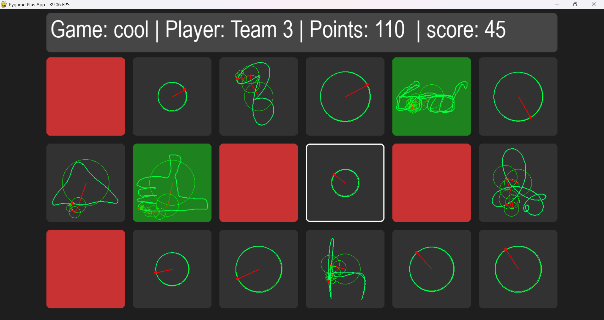

# Sketch Siege

**Sketch Siege** is a small experimental game built for a scouts activity.
Teams earn points in real life and spend those points to reveal hidden drawings.
The goal is simple: recognize the drawing before another team does and claim it.

The project was built quickly as a prototype using **Pygame** for the game interface and a **FastAPI** backend to handle points and validation.

## Concept

The game runs on a central screen showing a grid of hidden drawings.

Each drawing starts almost invisible. Players can spend points to reveal parts of a drawing. Every point reveals an additional **circle** of the drawing. The more circles that are revealed, the clearer the image becomes.

Teams must decide how to spend their points:

* invest points into revealing a drawing
* try to recognize the drawing as early as possible
* claim it before another team figures it out

Once a team correctly claims a drawing:

* the drawing becomes locked
* the team receives the points for the drawing
* other teams can no longer claim it

Teams do **not know which drawings other teams are working on**, which adds a tactical element to the game.

## Gameplay Flow

1. Teams earn points during real-life activities.
2. Points are entered through a simple website.
3. Each point reveals another circle of a drawing.
4. Teams watch the screen and try to recognize drawings.
5. When a team thinks they know the drawing, they claim it.
6. If correct, the drawing is locked and the team gets the reward.

## Tech Stack

Frontend:

* **Pygame** for rendering the game board
* custom drawing visualization system

Backend:

* **FastAPI** for handling points and claims
* simple web interface used to validate points

The backend only manages the game state and point system. The game itself runs locally on the main display.

## Purpose

This project was built as a **fast prototype for a scouts game**.
The focus was on experimenting with the idea of linking **real-world actions to a shared digital puzzle**.

The system is intentionally simple and was created in a short time for a specific event.
## Screenshot

